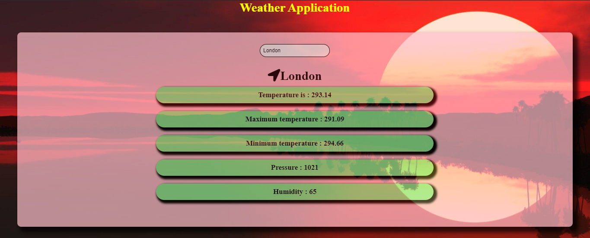
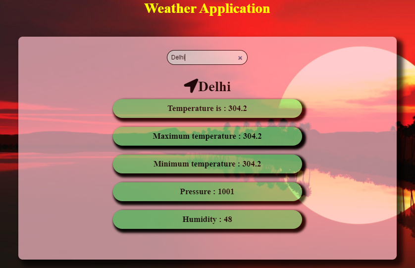
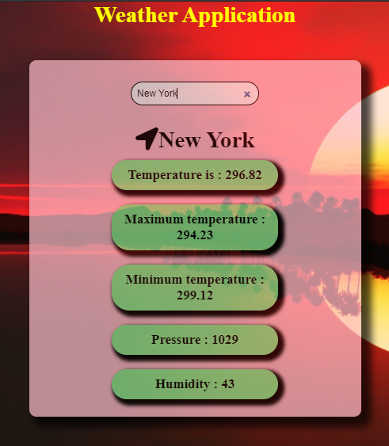

# Weather 🌤🌩🌪

Weather is a front-end application made using <b>React.Js</b> and is handy for a user to view Temperature , its Max and Min Range , Pressure and Humidity of a particular City he has entered in the search box . The application is complete responsive and can be used on all devices

Following is the glimpse of the application on different devices

### 🚩 Large Device View 

  

### 🚩 Medium Device View 

  

### 🚩 Small Device View 

  

